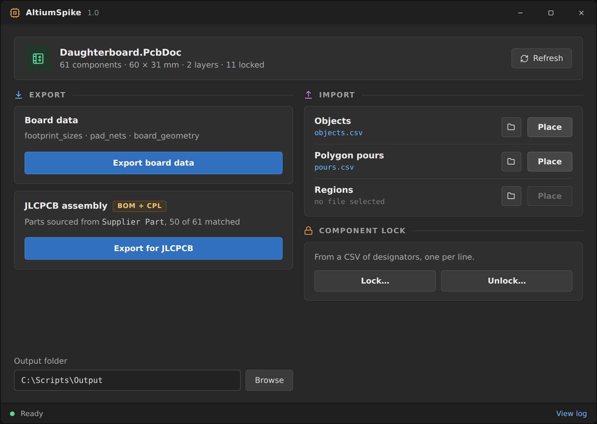
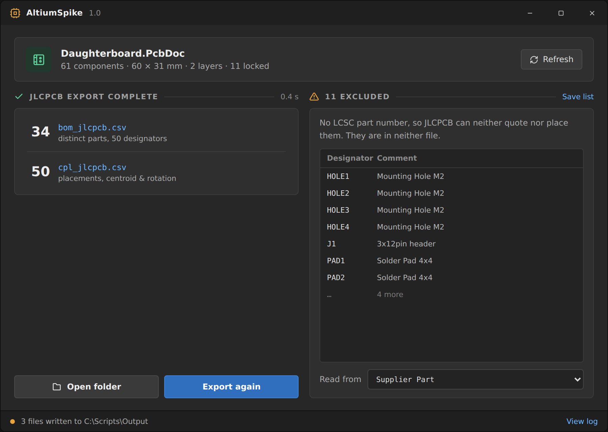

# AltiumSpike

A C# extension for **Altium Designer 26** that adds CSV import/export and JLCPCB
assembly output, in one window.

It exports board data for external tooling, places components, tracks, vias,
pours and regions back from CSV, locks and unlocks components, and generates
JLCPCB-ready BOM and pick-and-place files.



> The images in this README are renderings of the UI design, not photographs of
> a running session. The shipped window is built from these designs and matches
> them closely, but treat them as illustrations rather than screenshots.

---

## What it does

### Export

| Output | Contents |
| --- | --- |
| `footprint_sizes.csv` | `Designator,Pattern,Width,Height,CenterOffsetX,CenterOffsetY,X,Y,Rotation,Layer,Locked` |
| `pad_nets.csv` | `Designator,PadNumber,NetName,X,Y` |
| `board_geometry.csv` | `Type,Name,Index,X,Y,Diameter` — ordered outline vertices and mounting holes |

All coordinates are millimetres in absolute board coordinates.

### JLCPCB assembly

| Output | Contents |
| --- | --- |
| `bom_jlcpcb.csv` | `Comment,Designator,Footprint,LCSC Part #` |
| `cpl_jlcpcb.csv` | `Designator,Mid X,Mid Y,Layer,Rotation` |
| `bom_missing_lcsc.csv` | Components with no LCSC number — your checklist, not for upload |

Components without an LCSC part number are excluded from **both** deliverables,
because JLCPCB can neither quote nor place them. They appear only in the
missing-parts file.

`Mid X` / `Mid Y` are the true component **centroid**, computed from the
bounding rectangle — not Altium's footprint anchor, which can differ by a
fraction of a millimetre and would offset parts on the assembly line.

### Import

| Input | Contents |
| --- | --- |
| `objects.csv` | 17 columns, dispatched by `ObjectType`: Component, Track, Via, Arc, Fill, Text, Coordinate |
| `pours.csv` | `Net,Layer,X1,Y1,X2,Y2` — rectangular solid polygon pours |
| `regions.csv` | `RegionKind,Layer,Net,X1,Y1,X2,Y2` — copper or keep-out regions |
| lock list | One designator per line |

Every batch is wrapped in `PreProcess`/`PostProcess` and each component edit in
`BeginModify`/`EndModify` with `try/finally`, so a bad row cannot leave a
dangling edit transaction that blocks **File → Save** afterwards.



---

## Requirements

- **Altium Designer 26** (this targets the .NET 8 SDK it ships; see below)
- **.NET 8 SDK** — `winget install Microsoft.DotNet.SDK.8`
- Windows x64

Altium 26 hosts **.NET 8 with WPF**, shipping its own runtime under
`System\DotNet\Runtime\shared\Microsoft.NETCore.App\8.0.x`. An extension built
against .NET Framework will not load.

---

## Build

```powershell
git clone https://github.com/<you>/altium-spike.git
cd altium-spike
```

Copy the two SDK assemblies out of your Altium installation into an
`Assemblies` folder — they are proprietary and are not included here:

```powershell
mkdir Assemblies
copy "C:\Program Files\Altium\AD22\System\Altium.SDK.dll" Assemblies\
copy "C:\Program Files\Altium\AD22\System\Altium.SDK.Interfaces.dll" Assemblies\
```

> The folder is named after the version that **first** installed Altium and
> keeps that name across upgrades — a current Altium 26 often lives in `AD22`.
> Check your actual path.

Then:

```powershell
dotnet build -c Debug
```

## Deploy

With **Altium closed**:

```powershell
.\Deploy.ps1
```

`Deploy.ps1` builds, copies the output into Altium's extensions folder and
registers the extension. It discovers the installation rather than hardcoding
a GUID, backs up `ExtensionsRegistry.xml` before editing it, and inherits the
DXP/EDP build numbers already present so the entry is accepted.

```
.\Deploy.ps1 -SkipBuild   # copy and register an existing build
.\Deploy.ps1 -Force       # proceed even if Altium is running
```

Altium can hold the DLL for up to ~90 seconds after exit; if the copy fails
with a file lock, wait and re-run.

Start Altium, open a `.PcbDoc`, then **PCB → Tools → AltiumSpike…**

### Uninstalling

Delete the `AltiumSpike` folder from
`C:\ProgramData\Altium\Altium Designer {GUID}\Extensions\` and restore
`ExtensionsRegistry.xml.bak` from the same folder.

---

## Where the LCSC part number comes from

There is **no** standard Altium parameter called `LCSC Part #`, despite what
most JLCPCB tutorials assume. Components imported by the
[EasyEDA Loader](https://github.com/expired6978/EasyEDALoader) carry four
parameters:

```
Supplier          e.g. "LCSC"
Supplier Part     the LCSC part number   <-- this one
Manufacturer
Manufacturer Part
```

`JlcExport.cs` reads `Supplier Part` first and validates that `Supplier`
actually names LCSC, so a Digi-Key or Mouser code sitting in that field is not
passed off as an LCSC number. Other spellings are tried as fallbacks, and every
parameter name found on the board is written to the log so an unmatched field
can be identified rather than guessed at.

---

## Notes for anyone extending this

Hard-won details that cost real time to establish:

- **The factory type must be named `CSharpPlugin.PluginFactory`** — that exact
  fully-qualified name. Altium looks it up by name. Put it in your own
  namespace and the server "starts" in `DXP_Startup.log` while none of your
  code ever runs, with no error anywhere.
- `InvokePluginFactory(IClient)` must be an **instance** method with a public
  parameterless constructor. Static does not bind.
- The module derives from `DXP.ServerModule`; its only abstract member is
  `NewDocumentInstance`. Register commands in `InitializeCommands()`, and note
  that the inherited `CommandLauncher` property is typed `ICommandLauncher`
  while `RegisterCommand` lives on the concrete `DXP.CommandLauncher`.
- A **submenu** in a `.rcs` is a nested `Tree … End` block, injected with
  `TreeCopy … OriginalID='…'`. Altium's own `AdvPcb.rcs` (UTF-16, under
  `System\Resources\<lang>\`) is the only real reference for the format.
- The C# API is **not** a rename of DelphiScript. `Arc.XCenter` is
  `SetState_CenterX`; `Via.LowLayer` takes an `IV7_Layer` obtained via
  `pcbServer.LayerUtils().FromString("Top Layer")`; `AddFilter_LayerSet(AllLayers)`
  is the no-argument `AddFilter_AllLayers()`.
- `IPCB_Fill`'s `SetState_LocationX/Y` is the **lower-left corner**, not the
  centre, and `Length` is the X extent while `Width` is the Y extent. Altium's
  Properties panel displays the centre, which makes a wrong implementation look
  right.
- `Component.Moveable` is inverted: **`false` means locked**.
- To match DelphiScript's numeric output exactly: format with
  `CultureInfo.InvariantCulture`, normalise negative zero (.NET prints
  `-0.000` where Delphi prints `0.000`), and round with
  `MidpointRounding.AwayFromZero` — `Math.Round` defaults to banker's rounding.

The window is built entirely in code with no XAML, so it compiles both with
`UseWPF`/`net8.0-windows` and against Altium's own WPF assemblies on a plain
`net8.0` target.

---

## Status

Verified against a real 2-layer board in Altium 26.8.1:

- Board-data export is **byte-identical** to the DelphiScript implementation it
  replaces (all three files, md5-matched).
- JLCPCB export cross-checked — no excluded designator reaches either
  deliverable, BOM and CPL cover the identical component set, and the CPL
  passes format conformance.
- All seven `objects.csv` types, pours, regions and lock/unlock placed
  correctly and were read back to confirm.

Known rough edges:

- Rectangular pours and regions only; arbitrary outlines are not implemented.
- Standalone pads and dimensions are not handled by `objects.csv`.
- The UI is dark-themed to sit beside Altium's default theme.

---

## Licence

GPL-3.0-or-later. See [LICENSE](LICENSE).

The Altium SDK assemblies this builds against are proprietary and are not
included or redistributed here.

The plugin entry-point pattern (`CSharpPlugin.PluginFactory`) follows
[expired6978/EasyEDALoader](https://github.com/expired6978/EasyEDALoader), which
was the only working example of a C# Altium extension I could find.
